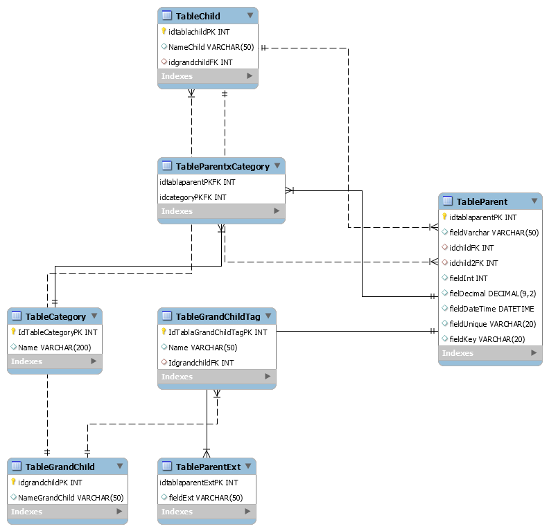

# Example of a minimal relational database
It is a minimal relational database for MySQL and Sql Server

## Objectives of the database

* To have a database with different kind of relations of tables.
  * MANY TO ONE
  * ONE TO MANY
  * MANY TO MANY
  * ONE TO ONE
  * MANY TO MANY
  * (optional) MANY TO ONE & MANY TO ONE & ONE TO MANY
* Minimal information. This database has at most 5 rows of data.
* It has a few nulls
* All Primary Keys (PKs) are of the type **int** and they have a postfix "**PK**"
  * Some of them are identity.
* All Foreign Keys (FKs) are of the type **int** and they have a postfix "**FK**"
* The table **TableParent** showcase the next types
  * int
  * varchar
  * decimal
  * datetime
* The table **TableParent** has the next keys
  * Primary Key
  * Foreign Keys
  * Unique Key
  * Regular Key

## Description

The main table is the table **TableParent**. It could be used as the initial table.

## Tables

| Table                | Relation with Parent                    | Example                                                      |
| -------------------- | --------------------------------------- | ------------------------------------------------------------ |
| TableParent          | -                                       | -                                                            |
| TableChild           | Many To One                             | TableParent - TableChild                                     |
| TableGrandChild      | Many to One - Many to One               | TableParent - TableChild - TableGrandChild                   |
| TableGrandChildTag   | Many to One - Many to One - One to Many | TableParent - TableChild - TableGrandChild - TableGrandChildTag |
| TableParentxCategory | Many to Many                            | TableParent - TableParentxCategory - TableCategory           |
| TableCategory        | Many to Many                            | TableParent - TableParentxCategory - TableCategory           |
| TableParentExt       | One to One                              | TableParent - TableParentExt                                 |

> Note: **TableParent** doesn't have a One To Many relation but **TableChild** has it.
>
> Note: **TableParent** is related two times with the **TableChild**

## Diagram

## Mysql Install

[mysql/mysql.sql](mysql/mysql.sql)

Run the next script. It will create the database called testdb

> This database is compatible with Mysql 8.0 and higher. It could run with Mysql 5.x but it could require to change the encoding.

## Sql Server Install

Recover the next backups.

For Sql Server 2012 and higher

[sqlserver/testdb2012.bak](sqlserver/testdb2012.bak)

For Sql Server 2019 and higher

[sqlserver/testdb2019.bak](sqlserver/testdb2019.bak)

## Copyright

MIT License

Copyright (c) 2020 Escuela de Formación Técnica Chile SPA

## Changelog

* 1.0 2020-07-04 First version

  